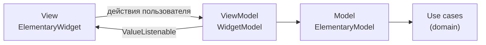

# habit_tracker — трекер привычек: Clean Architecture + MVVM (Elementary)

Приложение помогает формировать полезные привычки. Можно создавать привычки
(название, иконка, цвет), отмечать их выполнение каждый день, следить за сериями
и статистикой. Данные хранятся на устройстве, интернет не нужен.

## Возможности

- Список привычек со сводкой «выполнено сегодня» и полоской последних 7 дней.
- Отметка за сегодня одним нажатием; серия 🔥 пересчитывается сразу.
- Экран привычки: текущая и лучшая серия, процент выполнения за 30 дней,
  история за 30 дней (нажатием можно отметить пропущенный день задним числом).
- Создание, редактирование и удаление привычки с проверкой названия.
- Данные сохраняются между запусками (`shared_preferences`).
- Адаптивная вёрстка (две колонки на широком экране), светлая и тёмная тема.

## Архитектура

### Чистая архитектура: три слоя

Зависимости направлены внутрь: **presentation → domain ← data**.

| Слой | Содержимое |
|---|---|
| **domain** | Сущности `Habit`, `HabitStats`; бизнес-правила `HabitRules`; интерфейс `HabitRepository`; use case'ы `GetHabits`, `CreateHabit`, `UpdateHabit`, `DeleteHabit`, `ToggleHabitCompletion`, `CalculateHabitStats`. Чистый Dart, без Flutter. |
| **data** | `HabitModel` (JSON), `HabitLocalDataSource` (shared_preferences), `HabitRepositoryImpl`. |
| **presentation** | Экраны на Elementary (MVVM). |
| **core** | `Result` (Success / Failed), `Failure`, исключения, утилиты дат. |

Бизнес-логика целиком в domain: подсчёт серий и процента выполнения,
запрет отмечать будущие дни, проверка названия. Её легко тестировать без интерфейса.

### MVVM на Elementary

Каждый экран состоит из трёх классов:



| Роль | Класс Elementary | Что делает |
|---|---|---|
| **View** | `ElementaryWidget` (`*_screen.dart`) | Только описывает интерфейс по данным WidgetModel. Без логики, без `BuildContext` в `build`. |
| **ViewModel** | `WidgetModel` (`*_wm.dart`) | Состояние экрана в `ValueNotifier`, обработка действий, навигация, SnackBar. Доступна View через интерфейс `I…WidgetModel`. |
| **Model** | `ElementaryModel` (`*_model.dart`) | Вызывает use case'ы и готовит данные для экрана. Не знает о виджетах. |

Экраны: `HabitsListScreen` (список), `HabitEditorScreen` (создание и редактирование),
`HabitDetailsScreen` (статистика и история).

### Внедрение зависимостей

`AppDependencies` (корень композиции) создаёт источник данных, репозиторий и use case'ы.
`DependenciesScope` передаёт их вниз по дереву. Фабрики WidgetModel
(`habitsListWidgetModelFactory` и др.) берут оттуда use case'ы и собирают Model.

## Структура

```
lib/
├── main.dart
├── app/
│   ├── app.dart                         // MaterialApp, темы
│   └── di/app_dependencies.dart         // сборка зависимостей
├── core/                                // Result, Failure, исключения, даты
└── features/habits/
    ├── domain/   entities/ rules/ repositories/ usecases/
    ├── data/     models/ datasources/ repositories/
    └── presentation/
        ├── common/                      // общие виджеты и данные для UI
        └── screens/
            ├── habits_list/             // *_screen, *_wm, *_model, *_state, widgets/
            ├── habit_editor/
            └── habit_details/
test/
├── domain/        // статистика и use case'ы
├── data/          // репозиторий с shared_preferences
└── presentation/  // Model экрана и сценарий «создать и отметить»
```

## Пакеты

`elementary`, `equatable`, `shared_preferences`.

## Запуск

```bash
flutter create .   # создаст папки платформ (android, ios, windows, web…)
flutter pub get
flutter run
```

Тесты: `flutter test`. Перед запуском тестов удалите шаблонный `test/widget_test.dart`,
если его создала команда `flutter create .`.
